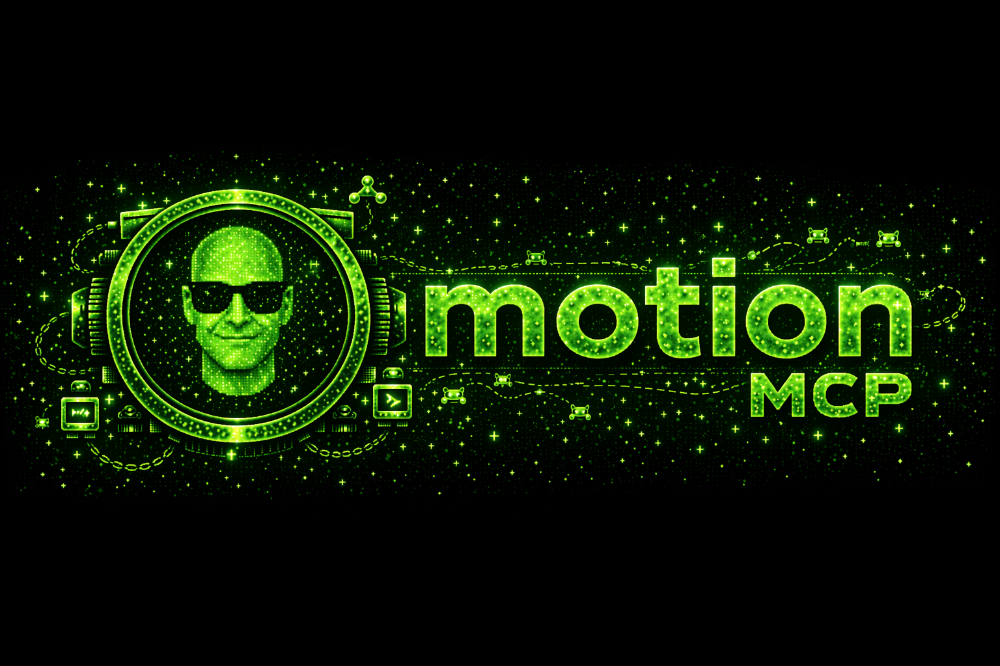

<a id="quick-navigation"></a>

<div align="center">

# Motion MCP



**Full calendar access for Claude Code — events, availability, scheduling.**

**What Motion's public API should have been, but they chose not to (for some reason, so I fixed it).**

[](https://www.npmjs.com/package/fidgetcoding-motion-mcp)
[](https://opensource.org/licenses/MIT)
[](https://nodejs.org)
[](https://modelcontextprotocol.io)

</div>

---

## Quick Navigation

| Link | Section | What it does | Time |
|---|---|---|---|
| [Natural Language Examples](#natural-language-examples) | Talk to it | Copy-paste prompts for events, availability, teammates, all-day | ~1 min |
| [Why This Exists](#why-this-exists) | Why | The Motion public API gap and why this shim exists | ~2 min |
| [How This Compares](#how-this-compares) | Comparison | vs Motion web/app, raw public API, no-MCP baseline | ~1 min |
| [Install](#install) | Setup | One-liner to wire the MCP into Claude | ~1 min |
| [Tools](#tools) | Reference | All 12 MCP tools — calendar + tasks | ~2 min |
| [Usage Examples](#usage-examples) | Reference | Worked flows (today, availability, recurring, move) | ~2 min |
| [Configuration](#configuration) | Setup | Env vars, default calendar, timezone | ~3 min |
| [Troubleshooting](#troubleshooting) | Reference | Auth failures, token expiry, sync delays | ~2 min |
| [Security](#security) | Reference | Secret handling + disclosure | ~1 min |
| [Project Status](#project-status) | Meta | Low-maintenance mode + where to go instead | ~1 min |
| [License](#license) | Meta | MIT | — |
| [Author](#author) | Meta | Who built it | — |

---

## Natural Language Examples

> [!IMPORTANT]
> **You talk. Claude dispatches. No commands, no syntax, no JSON.**
>
> Once this MCP is installed, you drive your Motion calendar through Claude in plain English. Claude picks the tool, fills in the parameters, and hands the result back in conversation.

```
"What's on my calendar today?"
```

```
"Am I free Thursday afternoon? Find me any 45-minute gaps between 1pm and 5pm."
```

```
"Create a 30-minute meeting called 'Team Sync' tomorrow at 2pm with drew@example.com."
```

```
"Move my 3pm call to 4pm, same day."
```

```
"Cancel the standup on Friday."
```

```
"Search my calendar for anything about onboarding this month."
```

```
"Is Sarah busy Wednesday morning? Pull her events between 9am and noon."
```

```
"List all my teammates so I know whose availability I can check."
```

```
"Show me every all-day event this week — out of office, holidays, deadlines."
```

```
"Force a sync with Google Calendar, I just added something over there and want it to show up here."
```

Every one of the above becomes a tool call under the hood. You never have to know which tool. You never have to build a payload. You just say the sentence.

<p align="right"><a href="#quick-navigation">↑ back to top</a></p>

---

## Why This Exists

> I was a paying Motion user for a long time. Then I tried to connect Motion to Claude via MCP and realized I'm paying ~$228/year for a calendar that doesn't really have smart tools — at least not ones I can hand to an agent. So I built this.

Motion bills itself as an AI-first calendar. The marketing promises scheduling intelligence, automatic rescheduling, teammate coordination. And inside the Motion web app, most of that is actually there. The problem is the public API.

Motion's public API has a respectable surface for **tasks and projects** — 27 endpoints covering create, list, update, workspaces, custom fields, statuses, recurring tasks. If all you want is "make Claude add a Motion task," you can wire that up in an afternoon against the docs. Several other Motion MCPs already exist for exactly that. The built-in Motion MCP does it. `@rf-d/motion-mcp` does it. `h3ro-dev/motion-mcp-server` does it.

None of them can touch calendar events. Neither can Motion's own public API.

For a product where the calendar *is* the product, that's a remarkable gap. You can create a task. You can set its priority. You can update its status. You cannot read, create, update, or delete a single event on the calendar that task is supposed to land on. You also can't check availability, list teammates, query free/busy, search events, pull all-day items, or manage which calendars are connected. Every surface that an agent would actually need to run your day is locked behind the internal API.

There's also no official Motion MCP server from Motion themselves. If there were one and it exposed the calendar endpoints cleanly, I wouldn't have written this. I waited, checked regularly, and eventually accepted that it wasn't coming.

So this MCP fills the gap by doing what the Motion web app does: it authenticates through Firebase (the same auth flow the Motion frontend uses) and talks to `internal.usemotion.com`. That gives Claude the full calendar surface — event CRUD, availability, search, teammate events, all-day events, sync triggers, calendar management. There's a bit of extra setup because you have to pull a Firebase refresh token out of your browser's IndexedDB, but once it's wired up, it just works.

Motion is a good product. The auto-scheduler is thoughtful, the UI is polished, their team clearly cares. You can sign up at [usemotion.com](https://www.usemotion.com/). But paying ~$228/year for a calendar that can't be driven by an agent is a hard sell for me personally, and the absence of an official MCP was the thing that eventually pushed me off the platform. If Motion ships a first-party MCP that covers this surface, I'll be genuinely happy — and honestly, this repo can probably retire the day they do.

Until then, this is here.

<p align="right"><a href="#quick-navigation">↑ back to top</a></p>

---

## How This Compares

| Capability | 🟢 **Motion MCP (this repo)** | Motion web/app | Raw Motion public API | No integration |
|---|---|---|---|---|
| Full event CRUD from Claude | 🟢 **✅ Yes** | Manual (GUI) | ❌ No | ❌ No |
| Availability / free-busy checks | 🟢 **✅ Yes** | ✅ Visual only | ❌ No | ❌ No |
| Teammate event visibility | 🟢 **✅ Yes** | ✅ Yes | ❌ No | ❌ No |
| Recurring events (create/read) | 🟢 **✅ Yes** (via `create_event`) | ✅ Yes | ❌ No | ❌ No |
| All-day event queries | 🟢 **✅ Yes** | ✅ Yes | ❌ No | ❌ No |
| Search events by text | 🟢 **✅ Yes** | ✅ Yes | ❌ No | ❌ No |
| Calendar management (enable/disable) | 🟢 **✅ Yes** | ✅ Yes | ❌ No | ❌ No |
| List connected calendars | 🟢 **✅ Yes** | ✅ Yes | ❌ No | ❌ No |
| Sync trigger (Google/Outlook) | 🟢 **✅ Yes** | ✅ Yes | ❌ No | ❌ No |
| Task read (public API) | 🟢 **✅ Yes** | ✅ Yes | ✅ Yes | ❌ No |
| Auto-scheduling integration | 🟢 **✅ Works** (events you create respect Motion's engine) | ✅ Yes | Partial (tasks only) | ❌ No |
| One-command install | 🟢 **✅ Yes** (`claude mcp add motion -- npx -y fidgetcoding-motion-mcp`) | N/A | N/A | N/A |
| Works with raw Motion subscription | 🟢 **✅ Yes** (standard Motion plan, no extra tier required) | ✅ Yes | ✅ Yes | N/A |
| Open source / MIT | 🟢 **✅ Yes** | ❌ Proprietary | N/A | N/A |

The tradeoff is honest: this MCP requires a few extra setup steps because it authenticates the way Motion's own web app does (Firebase refresh token + user ID pulled from your browser's IndexedDB). In exchange, you get the calendar surface that every other integration is locked out of.

<p align="right"><a href="#quick-navigation">↑ back to top</a></p>

---

## Install

One command:

```bash
claude mcp add motion -- npx -y fidgetcoding-motion-mcp
```

Then configure credentials (see [Configuration](#configuration)) and restart Claude Code.

If you'd rather set everything up inline in your Claude MCP config, skip ahead to [Configuration](#configuration) for the JSON shape.

<p align="right"><a href="#quick-navigation">↑ back to top</a></p>

---

## Tools

### Calendar tools (internal API)

| Name | What it does | Key params |
|---|---|---|
| `list_calendars` | List every calendar connected to your Motion account — names, IDs, source emails, enabled status. | *(none)* |
| `list_events` | Fetch events inside a date range with full details (title, time, attendees, location, conference link, recurrence). | `start`, `end`, `calendar_ids?` |
| `search_events` | Search events by text query across titles and descriptions. | `query`, `start?`, `end?` |
| `create_event` | Create an event with title, time, description, location, attendees. Defaults to your primary calendar if no ID is passed. Organizer, status, visibility, and timezone are filled in automatically. Supports recurrence. | `title`, `start`, `end`, `calendar_id?`, `description?`, `location?`, `attendees?`, `recurrence?` |
| `update_event` | Modify an existing event — title, time, description, location. | `event_id`, `title?`, `start?`, `end?`, `description?`, `location?` |
| `delete_event` | Remove an event by ID. | `event_id` |
| `check_availability` | Find open time slots across all calendars. Scans working hours (default 9am–6pm, weekdays) and returns gaps of at least a given duration. | `start`, `end`, `duration_minutes`, `working_hours?` |
| `get_teammate_events` | Pull a teammate's events for a date range given their user ID. Useful for "is Sarah free Wednesday morning?" | `user_ids`, `start`, `end` |
| `get_allday_events` | List all-day events separately (OOO, holidays, deadlines) with optional calendar filtering. | `start`, `end`, `calendar_id?` |
| `sync_calendars` | Force a sync between Motion and your connected providers (Google, Outlook). Useful when events were added externally. | *(none)* |
| `manage_calendars` | Enable or disable specific calendars inside your Motion account. | `calendar_id`, `enabled` |

### Task tools (public API)

| Name | What it does | Key params |
|---|---|---|
| `get_tasks` | List tasks with optional status filtering (`TODO`, `IN_PROGRESS`, `COMPLETED`). | `status?` |

> **Why only one task tool?** The full Motion task surface (create, update, projects, recurring, custom fields) is already well-served by the built-in Motion MCP and several community MCPs. This repo intentionally focuses on the calendar gap those other MCPs can't fill. `get_tasks` is included so you don't need a second MCP just to read task status alongside your calendar.

<p align="right"><a href="#quick-navigation">↑ back to top</a></p>

---

## Usage Examples

Worked examples — what you say, what Claude does, what comes back.

### Example 1 — "What's on my calendar today?"

**You:** *"What's on my calendar today?"*

**Claude calls:** `list_events` with `start` = today 00:00 and `end` = today 23:59 in your configured timezone.

**Result:** Claude summarizes the day in conversation: meeting titles, times, attendees, and any conference links. No spreadsheet. No JSON dump. Just the rundown.

---

### Example 2 — "Am I free Thursday afternoon for a 45-minute block?"

**You:** *"Am I free Thursday afternoon? I need a 45-minute block between 1pm and 5pm."*

**Claude calls:** `check_availability` with `start` = Thursday 13:00, `end` = Thursday 17:00, `duration_minutes` = 45.

**Result:** Claude returns the open gaps that meet the duration requirement — e.g., *"You're free 1:30–3:15 PM and 4:15–5:00 PM. Two slots fit 45 minutes."* If nothing fits, it says so directly.

---

### Example 3 — "Create a recurring weekly 1:1."

**You:** *"Create a 30-minute 1:1 with drew@example.com every Tuesday at 2pm, starting next Tuesday, called 'Drew <> Nate 1:1'."*

**Claude calls:** `create_event` with title, start/end in your timezone, `attendees: ["drew@example.com"]`, and a weekly recurrence rule.

**Result:** Event is created on your primary calendar, invite fires, Motion's auto-scheduler respects the fixed time. Claude confirms the event ID and first occurrence.

---

### Example 4 — "Move my 3pm to 4pm."

**You:** *"Move my 3pm meeting today to 4pm."*

**Claude calls:** `list_events` to find the 3pm event, then `update_event` with the new `start` and `end`.

**Result:** Event is moved, attendees are re-notified by Motion, Claude confirms with the new time. If there's more than one 3pm event, Claude asks which one before moving anything.

<p align="right"><a href="#quick-navigation">↑ back to top</a></p>

---

## Configuration

This MCP needs four credentials. The Motion API key is straightforward. The other three require extracting values from your browser — this is the price of reaching Motion's calendar endpoints, which are only exposed through their internal auth flow.

### Environment variables

| Variable | Required | Description |
|---|---|---|
| `MOTION_API_KEY` | Yes | Your Motion API key from **Settings → API** in the Motion web app. |
| `FIREBASE_API_KEY` | Yes | Firebase API key extracted from your browser (starts with `AIza`). See Step 2 below. |
| `FIREBASE_REFRESH_TOKEN` | Yes | Firebase refresh token from IndexedDB. See Step 2 below. |
| `MOTION_USER_ID` | Yes | Your Motion user ID. See Step 3 below. |
| `MOTION_TIMEZONE` | No | IANA timezone (default: `America/New_York`). Used for event headers and new-event defaults. Set this to match **your** locale — the default is just a default. |

### Step 1 — Get your Motion API key

1. Open [app.usemotion.com](https://app.usemotion.com).
2. Go to **Settings → API**.
3. Generate or copy your API key.

### Step 2 — Get your Firebase credentials

The internal API authenticates through Firebase. You need two values: a Firebase API key and a refresh token.

1. Open [app.usemotion.com](https://app.usemotion.com) in Chrome (or any Chromium browser with DevTools).
2. Open DevTools (`Cmd+Option+I` on Mac, `Ctrl+Shift+I` on Windows/Linux).
3. Go to **Application → IndexedDB → `firebaseLocalStorageDb` → `firebaseLocalStorage`**.
4. Click the entry in the table. A JSON object shows below.
5. Find `value → stsTokenManager → refreshToken` — copy the entire string. This is your `FIREBASE_REFRESH_TOKEN`.
6. For `FIREBASE_API_KEY`: open the **Network** tab, find any request to `googleapis.com`, and copy the value of the `key=` query parameter (it starts with `AIza`).

### Step 3 — Get your Motion User ID

Your user ID is visible in the same IndexedDB entry from Step 2 — look for the `uid` field. It's a string of letters and numbers (e.g., `abc123def456...`).

Alternatively, inspect any `internal.usemotion.com` request in the Network tab — the `userId` field appears in many of them.

### Step 4 — Set your default calendar (optional but recommended)

`create_event` defaults to your primary Motion calendar when no `calendar_id` is passed. "Primary" is whatever Motion has flagged as your default account — it's not hard-coded to a specific email. If you have multiple connected calendars and want Claude to route new events to a specific one, call `list_calendars` once to get the ID and pass it explicitly to `create_event`, or have Claude remember it for the session.

### Step 5 — Wire it into Claude

Either drop the credentials into a `.env` file at the project root:

```bash
MOTION_API_KEY=your_motion_api_key_here
FIREBASE_API_KEY=your_firebase_api_key_here
FIREBASE_REFRESH_TOKEN=your_firebase_refresh_token_here
MOTION_USER_ID=your_motion_user_id_here
MOTION_TIMEZONE=America/New_York
```

…or pass them via your Claude MCP config:

```json
{
  "mcpServers": {
    "motion": {
      "command": "npx",
      "args": ["-y", "fidgetcoding-motion-mcp"],
      "env": {
        "MOTION_API_KEY": "your_motion_api_key_here",
        "FIREBASE_API_KEY": "your_firebase_api_key_here",
        "FIREBASE_REFRESH_TOKEN": "your_firebase_refresh_token_here",
        "MOTION_USER_ID": "your_motion_user_id_here",
        "MOTION_TIMEZONE": "America/New_York"
      }
    }
  }
}
```

Restart Claude Code after either option.

<p align="right"><a href="#quick-navigation">↑ back to top</a></p>

---

## Troubleshooting

**"Authentication failed" or "Invalid refresh token".**
Firebase refresh tokens last roughly 6 months before they need re-issuing. Re-extract the refresh token from your browser using Step 2 above. The Firebase API key itself doesn't expire.

**"User ID not found" or calendar calls return empty.**
Your `MOTION_USER_ID` is likely stale or mistyped. Re-pull it from the same IndexedDB entry as the refresh token and make sure no whitespace snuck in.

**Rate-limit errors.**
Motion's **public** API enforces strict rate limits (around 12 requests per minute). The **internal** API is more generous because it's tuned for the web app's interactive use, but it is not infinite. Avoid tight polling loops and bulk operations. If you hit a 429, back off for a minute and retry.

**`create_event` succeeds but the event doesn't appear in Google/Outlook.**
Motion syncs outbound on its own schedule. If you just created the event and want it pushed immediately, call `sync_calendars` or ask Claude to *"force a Motion sync."*

**Firebase network tab shows no `googleapis.com` request.**
Refresh `app.usemotion.com` in that tab — a fresh page load always fires at least one Firebase auth request and the `key=` parameter will be visible on that call.

**You're seeing `firebaseLocalStorageDb` but the JSON structure looks different.**
Motion occasionally updates their frontend. The important fields are `refreshToken` (somewhere under `value`) and `uid`. If a path changes, grep the JSON — the values themselves are stable even when their nesting shifts.

<p align="right"><a href="#quick-navigation">↑ back to top</a></p>

---

## Security

Your Firebase refresh token and Motion API key together grant full access to your Motion account — calendars, events, tasks. Treat them like a password:

- Do **not** commit your `.env` file to version control. The included `.gitignore` excludes it, but verify.
- Do **not** paste either credential into shared chats, issues, or screenshots.
- Rotate the Motion API key from **Settings → API** if you suspect it has leaked. To invalidate the Firebase refresh token, sign out of all Motion browser sessions.

Full policy and responsible-disclosure contact: see [SECURITY.md](./SECURITY.md).

<p align="right"><a href="#quick-navigation">↑ back to top</a></p>

---

## License

MIT — see [LICENSE](./LICENSE) for details.

<p align="right"><a href="#quick-navigation">↑ back to top</a></p>

---

## Project Status

> **Heads up — low-maintenance mode.** I stopped using Motion myself, so I'm not actively building on this MCP anymore. It still works, and I'm leaving it up for anyone still on Motion who wants agentic calendar access. But updates will be sporadic, and I may not keep pace with Motion API changes.
>
> The MCP I actively maintain is **[morgen-mcp](https://github.com/lorecraft-io/morgen-mcp)** — same philosophy, different calendar. If you're evaluating calendars and flexible enough to switch, Morgen + morgen-mcp is where I landed.

If Motion ships a first-party MCP with the calendar surface, I'll link it at the top of this README and step out of the way.

<p align="right"><a href="#quick-navigation">↑ back to top</a></p>

---

## Author

Built by **Nate Davidovich** / [Lorecraft](https://github.com/lorecraft-io).

- GitHub: [lorecraft-io](https://github.com/lorecraft-io)
- npm: [lorecraft](https://www.npmjs.com/~lorecraft)
- Sister project: [morgen-mcp](https://github.com/lorecraft-io/morgen-mcp) (actively maintained)

<p align="right"><a href="#quick-navigation">↑ back to top</a></p>
